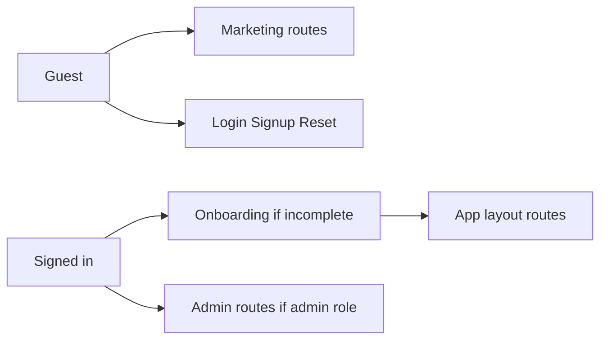

# Phase 1 — Foundation implementation plan

## Context

- Workspace today: only [AGENTS.md](c:\Users\DELL\Downloads\GoSolo\AGENTS.md) and [docs/PRD.md](c:\Users\DELL\Downloads\GoSolo\docs\PRD.md). No app code yet.
- Stack and rules are locked in AGENTS.md (Next.js App Router, strict TS, Tailwind, shadcn/ui, Supabase, Zod, RHF, no service role in browser).
- PRD [§9](c:\Users\DELL\Downloads\GoSolo\docs\PRD.md) defines public, auth, app, and admin URL shapes; [§10–§11](c:\Users\DELL\Downloads\GoSolo\docs\PRD.md) describe the full MVP schema and RLS model (Phase 1 ships only the foundation subset below); [§15](c:\Users\DELL\Downloads\GoSolo\docs\PRD.md) lists Phase 1 deliverables; [§19](c:\Users\DELL\Downloads\GoSolo\docs\PRD.md) forbids AI/payments/bookings in Phase 1 and allows schema, auth, onboarding, layouts, public pages, role gating, profile foundation.

## Architectural choices (minimal)

- **Supabase in Next.js**: Use `@supabase/supabase-js` with `@supabase/ssr` for cookie-based sessions (App Router–compatible). Browser: anon key only; server components / route handlers / server actions use the server client pattern from Supabase docs.
- **Route protection**: Combine **Next.js `middleware.ts`** (session refresh + coarse path checks) with **layout-level server checks** in `(app)` and `(admin)` route groups for authoritative gating (session + profile/onboarding + role). This matches “server-side checks” in PRD §11 without overbuilding a separate auth framework.
- **Schema scope in Phase 1**: Implement only the Phase 1 foundation schema required for auth, onboarding, and admin route gating:
  - `profiles`
  - `user_roles`
  - `user_private`
  - `handle_new_user` trigger (creates the three rows above for each new `auth.users` row)
  - `set_updated_at` on mutable Phase 1 tables
  - RLS enabled with policies only on these three tables
  - Minimal SQL helper functions for role/admin checks (no room-membership or moderation helpers)

  The remaining PRD §10 product tables (`travel_intents`, rooms, messages, reports, etc.) are not created in Phase 1; they will be added in later phases via separate migrations.

- **Onboarding vs Phase 2**: Wizard covers PRD onboarding items (age confirmation, profile basics, interests, travel style) by writing to `profiles` / `user_private` and sets `profiles.onboarding_completed = true` at the end. Full profile editor and dashboard product UI stay Phase 2; Phase 1 may use a **minimal `/dashboard` placeholder** only to prove app-route access after gating.

## Sequential tasks

Execute in order; each task should be a small, reviewable change.

### A. Repository and Next.js scaffold

1. **Initialize Next.js** in the repo root (or agreed `src/` layout): App Router, TypeScript, ESLint, Tailwind, `src` directory if matching PRD [§14](c:\Users\DELL\Downloads\GoSolo\docs\PRD.md) structure.
2. **Align with PRD folder shape**: Under `src/app/`, create route groups `(marketing)`, `(auth)`, `(app)`, `(admin)` as empty shells; add `src/components/ui`, `src/components/shared`, `src/features/*` (minimal folders), `src/lib/*`, `src/types` as needed.
3. **Strict TypeScript**: Enable strict compiler options in `tsconfig.json` per AGENTS.md.

### B. Tailwind and shadcn/ui

1. **Verify Tailwind** content paths for `src/`.
2. **Initialize shadcn/ui** (components in `src/components/ui`) and add only primitives needed for Phase 1: e.g. Button, Input, Label, Card, Form (if using RHF), toast/alert for errors—avoid importing the entire library.

### C. Supabase wiring (app only; no secrets in repo)

1. **Add dependencies**: `@supabase/supabase-js`, `@supabase/ssr`.
2. **Env template**: `.env.example` with `NEXT_PUBLIC_SUPABASE_URL` and `NEXT_PUBLIC_SUPABASE_ANON_KEY` (and document local Supabase vs cloud in README when added).
3. **Supabase client modules** under `src/lib/supabase/`: `client.ts` (browser), `server.ts` (server components / actions), `middleware.ts` helper for `middleware.ts` session update pattern.
4. **Root `middleware.ts`**: Match protected path prefixes; refresh session; redirect guests away from `(app)` and `(admin)`; redirect signed-in users away from login/signup as appropriate (optional polish).

### D. SQL migrations (Phase 1 schema + RLS)

1. **Supabase migration layout**: `supabase/migrations/` with timestamped SQL files (or a single initial migration if preferred, still versioned).
2. **Extensions**: Enable `pgcrypto` (or use `gen_random_uuid()` if available) consistently for UUID defaults.
3. **Phase 1 tables only**: Create `profiles`, `user_roles`, and `user_private` per PRD §10 column definitions for those tables (including onboarding, age confirmation, profile basics, interests, travel style, and `role` check on `user_roles` as specified there).
4. **Triggers**:
   - `handle_new_user` on `auth.users` to insert `profiles`, `user_private`, and `user_roles` with default `role = 'user'`.
   - `set_updated_at` on `profiles` and `user_private` (per PRD §10; `user_roles` has no `updated_at` in PRD).
5. **RLS**: `ENABLE ROW LEVEL SECURITY` on `profiles`, `user_roles`, and `user_private` only. Policies should match PRD §11 for these tables in spirit: e.g. `profiles` public read / self update, `user_private` self only, `user_roles` readable as needed for the signed-in user and for admin checks—without policies that assume tables that do not exist yet.
6. **Role helpers**: Add minimal `SECURITY DEFINER` or equivalent helpers only if required for consistent admin checks (e.g. `auth_user_is_admin()`), scoped to Phase 1. Do not add room-membership or moderation helpers.
7. **Apply and verify locally**: Run migrations against local Supabase and confirm a new signup creates one row each in `profiles`, `user_private`, and `user_roles`.

### E. Auth UI and flows

1. **`/signup`**: Email + password (PRD: email/password); call Supabase `signUp`; show errors/loading; link to login.
2. **`/login`**: Email + password; `signInWithPassword`; redirect toward intended destination or `/dashboard` (middleware/layout will correct if onboarding is incomplete).
3. **`/forgot-password`**: Request reset via Supabase (`resetPasswordForEmail`); calm copy; no custom email provider code in Phase 1 (Supabase handles delivery).
4. **Logout**: Server action or client sign-out clearing session; redirect to `/` or `/login`.
5. **Optional**: If Supabase project has email confirmation enabled, surface “check your email” state on signup (PRD: “if enabled”)—keep minimal.

### F. Layouts (public / auth / app / admin)

1. **Root layout**: Fonts, base metadata, providers only where needed (e.g. theme if shadcn requires).
2. **`(marketing)` layout**: Header/footer suitable for trust-first marketing (PRD [§12 Landing](c:\Users\DELL\Downloads\GoSolo\docs\PRD.md), [§13](c:\Users\DELL\Downloads\GoSolo\docs\PRD.md) tone)—no business modules.
3. **`(auth)` layout**: Centered, simple card layout for login/signup/reset/onboarding steps.
4. **`(app)` layout**: Authenticated shell (nav placeholder, sign out); **server-side**: require session; load `profiles` (and `user_private` if needed); if `!onboarding_completed`, redirect to `/onboarding`.
5. **`(admin)` layout**: Authenticated; **server-side**: require session and `user_roles.role = 'admin'`. Non-admin users redirect to `/dashboard`. Do not implement moderator-only route access in Phase 1.

### G. Onboarding wizard and gating

1. **Single route or stepped flow** at `/onboarding` (PRD [§9](c:\Users\DELL\Downloads\GoSolo\docs\PRD.md)): steps for **18+ / age confirmation** (`user_private.is_18_plus_confirmed`, optional DOB if collected), **profile basics** (e.g. `username`, `display_name`, `home_city`), **interests** (`profiles.interests`), **travel style** (`profiles.travel_style`—and other PRD profile fields present on `profiles` in this migration).
2. **Validation**: Zod schemas colocated under `src/lib/validation/` or `src/features/onboarding/`; React Hook Form for the wizard.
3. **Persist**: Updates via Supabase from server actions or forms with RLS (owner update on `profiles` / `user_private`).
4. **Completion**: Set `onboarding_completed = true` on final submit; redirect to `/dashboard`.
5. **Gating edge cases**: If user hits `/onboarding` when already complete, redirect to `/dashboard`; ensure logged-in users cannot skip onboarding into `(app)` routes.

### H. Marketing pages (public)

1. Implement static or mostly-static pages under `(marketing)`: `/`, `/about`, `/safety`, `/privacy`, `/terms`, `/contact` per PRD—India-only, 18+, not a package organizer (PRD [§1–§3](c:\Users\DELL\Downloads\GoSolo\docs\PRD.md), [§12 Landing](c:\Users\DELL\Downloads\GoSolo\docs\PRD.md)). No forms beyond contact if you add a simple mailto or placeholder (avoid building a full ticketing backend in Phase 1).

### I. Minimal app and admin shells (for acceptance only)

1. **`/dashboard`**: Placeholder content only (“Foundation complete”)—enough to confirm an onboarded user can enter `(app)`.
2. **Admin routes** `/admin`, `/admin/reports`, `/admin/users`, `/admin/rooms`, `/admin/moderation-actions`: **placeholder pages** behind admin layout; no report queues or data tooling (Phase 6). Document that local testing of admin routes requires setting `user_roles.role = 'admin'` for one user (e.g. via SQL or dashboard).

### J. Quality gates and documentation

1. **README**: Setup steps—Node version, `pnpm`/`npm`, Supabase CLI link, env vars, running migrations, creating first user and promoting to admin for testing.
2. **Lint and typecheck**: Fix ESLint/TS issues after each major chunk.
3. **Tests (light)**: If test scaffolding exists from `create-next-app`, add optional smoke tests; otherwise document manual QA for signup, login, logout, forgot password, onboarding redirect, and admin route protection. Automated tests can wait for a later hardening phase.

## Phase 1 acceptance mapping

| Criterion | How it is satisfied |
| --- | --- |
| Sign up, log in, log out, password reset | Auth routes + Supabase Auth calls |
| Redirect to onboarding if incomplete | `(app)` layout checks `profiles.onboarding_completed` |
| Guest cannot access app routes | Middleware + `(app)` layout session check |
| Non-admin cannot access admin routes | `(admin)` layout checks `user_roles` for `admin` only |
| Core schema in migrations | Phase 1 foundation tables (`profiles`, `user_roles`, `user_private`) in versioned SQL |
| RLS on created tables | `ENABLE ROW LEVEL SECURITY` + policies on each created table |

## Explicitly out of scope (later phases)

- Profile editor beyond onboarding fields, travel intent CRUD, discovery, rooms, chat, realtime, reports/blocks UI, notifications UI, full admin tooling (Phase 2–6 per PRD [§15](c:\Users\DELL\Downloads\GoSolo\docs\PRD.md)).
- Payments, AI, bookings, Aadhaar (PRD [§19](c:\Users\DELL\Downloads\GoSolo\docs\PRD.md)).
