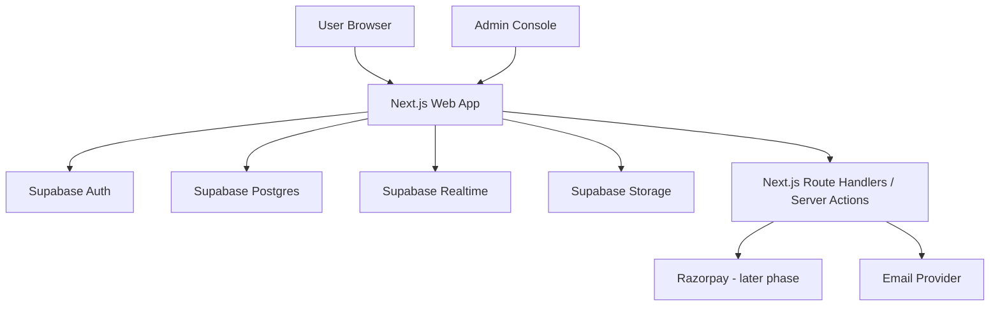

# Solo Traveler Matching & Planning Platform
## Cursor PRD + Technical Build Spec

Version: 2.0  
Status: Approved for Cursor build  
Primary market: India only  
Platform scope: Web-first, mobile later  
Build mode: Step-by-step implementation in Cursor  
Primary builder: Cursor  

---

## 1. Product Summary

### Working product name
Solo Traveler Matching & Planning Platform

### Product vision
Build a trusted platform where solo travelers can:
- create an account,
- build a trustworthy profile,
- publish travel intent,
- discover compatible co-travelers,
- form a destination-based trip group,
- collaborate in a shared trip room,
- plan their own trip together without travel packages.

### Core positioning
This is **not** a travel package marketplace.  
This is **not** a travel agency.  
This is **not** a group tour operator.  
This is a **platform/intermediary** that helps solo travelers discover each other and collaboratively plan trips.

### MVP goal
Launch a stable, secure, mobile-first web MVP for India that allows users to:
1. sign up and complete onboarding,
2. create and manage a profile,
3. publish travel intent,
4. discover compatible travelers,
5. create and join trip rooms,
6. collaborate through room chat, itinerary, and polls,
7. report/block unsafe users,
8. support moderator and admin operations.

---

## 2. Build Decision

### Final web architecture choice
Use **Next.js App Router** for the web application and **Supabase** for backend services.

### Why this is the correct stack for Cursor
Cursor is a coding environment and agent workflow, not a locked visual builder. It can work with arbitrary codebases, project rules, and indexed repositories. This means the previous Lovable constraint does not apply here. For this project, Next.js is preferred over plain React + Vite because the product benefits from:
- a strong file-based routing model,
- layouts and nested routing,
- built-in loading and error handling,
- route handlers for controlled server-side integrations,
- cleaner SEO for public marketing pages,
- a mature pairing with Supabase.

### Important clarification
We are **not** choosing “React instead of Next.js.”  
**Next.js is a React framework.**  
So the final frontend is still React-based, but with the structure and production features of Next.js.

---

## 3. Product Principles

1. **Trust first** - safety and moderation are core features.
2. **Simple MVP** - no overengineering in v1.
3. **Web-first** - optimize for mobile web first, mobile app later.
4. **India-only launch** - product and compliance choices optimized for India.
5. **18+ only** - no minors in MVP.
6. **No mandatory Aadhaar in MVP** - verification is optional and later.
7. **No travel packages** - users plan their own trips.
8. **No AI in MVP** - AI itinerary planning is a later phase.
9. **Stepwise delivery** - build foundation first, then core product, then safety/admin, then production hardening.
10. **Cursor must not redesign architecture mid-build** - architecture is locked in this document.

---

## 4. Final Tech Stack

### Web app
- Next.js (App Router)
- TypeScript
- React
- Tailwind CSS
- shadcn/ui
- React Hook Form
- Zod

### Backend platform
- Supabase Postgres
- Supabase Auth
- Supabase Storage
- Supabase Realtime
- Supabase SQL migrations
- Supabase Row Level Security

### Tooling
- GitHub
- GitHub Actions
- ESLint
- Prettier
- Playwright
- Vitest
- Husky optional

### Monitoring and ops
- Sentry
- basic uptime monitoring
- structured logging

### Payments
- Razorpay only, later phase

### Future mobile stack
- React Native / Expo

---

## 5. High-Level Architecture



### Deployment model
- Web app: Next.js deployment target
- Backend: Supabase project
- Database region: Mumbai / India
- Environments: local, staging, production

---

## 6. User Roles

### Guest
Can view public marketing pages.

### Registered user
Can onboard, create/edit profile, publish travel intent, discover others, join/create trip rooms, chat, collaborate, report, block, and manage personal settings.

### Moderator
Can review reports, inspect flagged content, and take moderation actions.

### Admin
Can manage moderator access, review abuse trends, inspect moderation actions, and administer the platform.

---

## 7. In Scope vs Out of Scope

### In scope for MVP
- email/password auth
- age confirmation
- onboarding wizard
- profile management
- travel intent CRUD
- traveler discovery feed
- rule-based matching summary
- trip room creation and membership
- realtime room chat
- itinerary items
- polls and voting
- report user / room / message
- block user
- notifications
- moderator/admin dashboard
- responsive web UI

### Out of scope for MVP
- AI chatbot / AI itinerary planner
- Aadhaar verification
- payments / subscriptions
- travel bookings
- wallet / pooled money / expense split
- mobile app
- deep social feed
- public comments/feed/timeline
- dating-style swipe-first interaction

---

## 8. Core Modules

### Module 1 - Authentication and Onboarding
Features:
- signup
- login
- logout
- password reset
- email verification if enabled
- age confirmation
- onboarding completion gating

### Module 2 - Profile Management
Features:
- username
- display name
- avatar
- bio
- home city
- interests
- travel style
- budget preference
- social vibe
- public profile preview

### Module 3 - Travel Intent
Features:
- destination
- dates
- budget range
- pace
- vibe
- note
- status

### Module 4 - Discovery and Matching
Features:
- discover feed
- filters
- overlap summary
- save/shortlist profile or travel intent
- block-aware filtering

### Module 5 - Trip Rooms
Features:
- create room
- join room
- manage membership
- room owner/member roles
- private room access

### Module 6 - Realtime Chat
Features:
- room chat
- realtime message updates
- system messages
- hidden message support for moderation

### Module 7 - Collaborative Itinerary
Features:
- itinerary items
- day grouping
- ordering
- notes
- shared editing

### Module 8 - Polls
Features:
- create poll
- multiple options
- one vote per user
- room-only visibility

### Module 9 - Trust and Safety
Features:
- block user
- report user
- report message
- report room
- safety guidance page

### Module 10 - Notifications
Features:
- in-app notifications
- read/unread state

### Module 11 - Admin and Moderation
Features:
- report queue
- user lookup
- room lookup
- moderation actions
- audit trail

---

## 9. Information Architecture

### Public routes
- `/`
- `/about`
- `/safety`
- `/privacy`
- `/terms`
- `/contact`

### Auth routes
- `/login`
- `/signup`
- `/forgot-password`
- `/onboarding`

### App routes
- `/dashboard`
- `/explore`
- `/intents`
- `/intents/new`
- `/matches`
- `/rooms`
- `/rooms/[roomId]`
- `/profile/me`
- `/profile/[username]`
- `/settings`
- `/notifications`

### Admin routes
- `/admin`
- `/admin/reports`
- `/admin/users`
- `/admin/rooms`
- `/admin/moderation-actions`

---

## 10. Database Design - MVP Core Schema

### Core app tables (16 total)

#### 1. `user_roles`
- `user_id` uuid pk references auth.users
- `role` text check in ('user','moderator','admin')
- `created_at` timestamptz

#### 2. `profiles`
- `id` uuid pk references auth.users
- `username` text unique
- `display_name` text
- `avatar_url` text nullable
- `bio` text nullable
- `home_city` text nullable
- `travel_style` text nullable
- `budget_preference` text nullable
- `social_vibe` text nullable
- `interests` text[] default '{}'
- `onboarding_completed` boolean default false
- `profile_completion_percent` int default 0
- `created_at` timestamptz
- `updated_at` timestamptz

#### 3. `user_private`
- `user_id` uuid pk references auth.users
- `date_of_birth` date nullable
- `is_18_plus_confirmed` boolean default false
- `phone_number` text nullable
- `verification_level` text default 'basic'
- `created_at` timestamptz
- `updated_at` timestamptz

#### 4. `travel_intents`
- `id` uuid pk
- `user_id` uuid references auth.users
- `destination_name` text
- `destination_state` text nullable
- `destination_country` text default 'India'
- `start_date` date
- `end_date` date
- `budget_min` numeric nullable
- `budget_max` numeric nullable
- `travel_pace` text nullable
- `trip_vibe` text[] default '{}'
- `interests` text[] default '{}'
- `note` text nullable
- `status` text default 'open'
- `created_at` timestamptz
- `updated_at` timestamptz

#### 5. `saved_profiles`
- `id` uuid pk
- `user_id` uuid references auth.users
- `target_user_id` uuid references auth.users
- `created_at` timestamptz
- unique (`user_id`, `target_user_id`)

#### 6. `trip_rooms`
- `id` uuid pk
- `owner_id` uuid references auth.users
- `title` text
- `description` text nullable
- `destination_name` text
- `start_date` date nullable
- `end_date` date nullable
- `visibility` text default 'private'
- `status` text default 'active'
- `created_at` timestamptz
- `updated_at` timestamptz

#### 7. `trip_room_members`
- `id` uuid pk
- `room_id` uuid references trip_rooms
- `user_id` uuid references auth.users
- `role` text default 'member'
- `membership_status` text default 'joined'
- `joined_at` timestamptz
- unique (`room_id`, `user_id`)

#### 8. `messages`
- `id` uuid pk
- `room_id` uuid references trip_rooms
- `sender_id` uuid references auth.users
- `content` text
- `message_type` text default 'text'
- `is_hidden` boolean default false
- `created_at` timestamptz

#### 9. `itinerary_items`
- `id` uuid pk
- `room_id` uuid references trip_rooms
- `created_by` uuid references auth.users
- `day_number` int nullable
- `activity_date` date nullable
- `activity_time` time nullable
- `title` text
- `notes` text nullable
- `sort_order` int default 0
- `created_at` timestamptz
- `updated_at` timestamptz

#### 10. `polls`
- `id` uuid pk
- `room_id` uuid references trip_rooms
- `created_by` uuid references auth.users
- `question` text
- `closes_at` timestamptz nullable
- `created_at` timestamptz

#### 11. `poll_options`
- `id` uuid pk
- `poll_id` uuid references polls
- `label` text
- `sort_order` int default 0

#### 12. `poll_votes`
- `id` uuid pk
- `poll_id` uuid references polls
- `option_id` uuid references poll_options
- `user_id` uuid references auth.users
- unique (`poll_id`, `user_id`)

#### 13. `blocks`
- `id` uuid pk
- `blocker_id` uuid references auth.users
- `blocked_id` uuid references auth.users
- `created_at` timestamptz
- unique (`blocker_id`, `blocked_id`)

#### 14. `reports`
- `id` uuid pk
- `reporter_id` uuid references auth.users
- `reported_user_id` uuid nullable references auth.users
- `room_id` uuid nullable references trip_rooms
- `message_id` uuid nullable references messages
- `reason_code` text
- `details` text nullable
- `status` text default 'open'
- `assigned_to` uuid nullable references auth.users
- `created_at` timestamptz
- `updated_at` timestamptz

#### 15. `moderation_actions`
- `id` uuid pk
- `actor_user_id` uuid references auth.users
- `target_user_id` uuid nullable references auth.users
- `target_room_id` uuid nullable references trip_rooms
- `target_message_id` uuid nullable references messages
- `action_type` text
- `notes` text nullable
- `created_at` timestamptz

#### 16. `notifications`
- `id` uuid pk
- `user_id` uuid references auth.users
- `type` text
- `title` text
- `body` text nullable
- `payload` jsonb nullable
- `read_at` timestamptz nullable
- `created_at` timestamptz

### Future tables - not in MVP implementation
- `feature_flags`
- `subscription_entitlements`
- `ai_usage`
- `verification_requests`

---

## 11. Security and Access Model

### Mandatory controls
- Row Level Security on all app tables
- role-based admin/mod routes
- server-side checks for privileged actions
- block-aware discovery and messaging
- private room content only for room members
- public profile limited to intended fields only
- no service-role key in browser

### RLS summary
- `profiles`: public read, self update
- `user_private`: self only
- `user_roles`: admin/mod read, self read if needed
- `travel_intents`: public read for open intents, owner write
- `saved_profiles`: self only
- `trip_rooms`: members only unless explicitly public later
- `trip_room_members`: members read, owner/admin manage
- `messages`: room members only
- `itinerary_items`: room members only
- `polls`, `poll_options`, `poll_votes`: room members only
- `blocks`: blocker only
- `reports`: reporter limited read, admin/mod full read
- `moderation_actions`: admin/mod only
- `notifications`: owner only

### Required triggers and helpers
- `handle_new_user` trigger to create `profiles`, `user_private`, and `user_roles`
- `set_updated_at` trigger on mutable tables
- helper policies/views for room membership checks
- helper functions for admin/mod role checks

---

## 12. Functional Requirements by Area

### Landing
- clear value proposition
- trust and safety emphasis
- CTA to sign up
- not framed as a package organizer

### Onboarding
- age confirmation
- profile basics
- interests
- travel style
- onboarding completion gating

### Dashboard
- summary of profile status
- active travel intents
- invites/rooms summary
- onboarding reminders if incomplete

### Explore
- list open travel intents or compatible travelers
- filters
- overlap summary
- block-aware results

### Intents
- create, edit, archive own intents

### Room detail
- room header
- member list
- chat
- itinerary
- polls
- report options

### Profile
- public profile view
- shared interests / compatibility summary
- report/block actions

### Settings
- profile updates
- privacy settings
- notification preferences
- account deletion request flow

### Admin
- report queue
- user lookup
- room lookup
- moderation log

---

## 13. UI and UX Direction

### Design system direction
- warm teal + earthy palette
- clean, grounded, trustworthy visual language
- mobile-first responsive design
- more planning and trust than social-media energy

### Interaction principles
- clarity over novelty
- strong empty states
- polite error messages
- obvious safety actions
- avoid swipe-first or dating-like mechanics

---

## 14. Recommended App Structure

```txt
src/
  app/
    (marketing)/
      page.tsx
      about/page.tsx
      safety/page.tsx
      privacy/page.tsx
      terms/page.tsx
      contact/page.tsx
    (auth)/
      login/page.tsx
      signup/page.tsx
      forgot-password/page.tsx
      onboarding/page.tsx
    (app)/
      dashboard/page.tsx
      explore/page.tsx
      intents/page.tsx
      intents/new/page.tsx
      matches/page.tsx
      rooms/page.tsx
      rooms/[roomId]/page.tsx
      notifications/page.tsx
      settings/page.tsx
      profile/me/page.tsx
      profile/[username]/page.tsx
    (admin)/
      admin/page.tsx
      admin/reports/page.tsx
      admin/users/page.tsx
      admin/rooms/page.tsx
      admin/moderation-actions/page.tsx
  components/
    ui/
    shared/
  features/
    auth/
    onboarding/
    profiles/
    intents/
    discovery/
    rooms/
    chat/
    itinerary/
    polls/
    safety/
    notifications/
    admin/
  lib/
    supabase/
    auth/
    validation/
    utils/
  types/
  tests/
```

---

## 15. Step-by-Step Build Sequence

### Phase 1 - Foundation
- initialize Next.js app
- configure TypeScript, ESLint, Tailwind, shadcn/ui
- connect Supabase
- create core SQL schema and RLS
- implement auth flow
- implement public/app/admin layouts
- implement onboarding wizard
- add route protection and role gating

### Phase 2 - Core Identity and Travel Intent
- profile edit/view
- travel intent CRUD
- dashboard shell
- settings shell

### Phase 3 - Discovery
- explore feed
- filters
- shortlist/saved profiles
- compatibility summary

### Phase 4 - Trip Rooms Collaboration
- create/join trip rooms
- room membership
- realtime room chat
- itinerary CRUD
- polls and voting

### Phase 5 - Trust and Safety
- block flows
- report flows
- notifications
- safety surface in key pages

### Phase 6 - Admin and Moderation
- reports queue
- moderation actions
- admin search and inspection tools
- audit visibility

### Phase 7 - Production Hardening
- error states
- loading states
- empty states
- Sentry
- test pass
- accessibility pass
- SEO for marketing pages

---

## 16. MVP Release Checklist

MVP is ready only when:
- signup/login/logout/reset all work
- onboarding gating works
- profile create/edit works
- travel intent CRUD works
- discovery works for open, non-blocked users
- trip room creation and membership work
- room chat works in realtime
- itinerary items work
- polls work
- report/block work
- admin/moderation routes work
- no major RLS leaks exist
- responsive UI works on mobile and desktop

---

## 17. Cursor Working Instructions

Cursor must:
- follow this PRD strictly
- build in phases only
- not redesign the architecture
- not swap Next.js for plain React + Vite
- not add AI, payments, or bookings in MVP
- not introduce Redux unless explicitly requested
- prefer server components by default and client components only where needed
- use route handlers/server actions only when appropriate
- use Zod for validation
- keep forms, services, and feature modules cleanly separated
- write migrations instead of hidden schema changes
- keep Supabase auth and RLS central to access control

---

## 18. Deliverables Cursor Should Produce

1. full Next.js codebase
2. Supabase SQL schema and migration files
3. route protection and auth flow
4. responsive UI for MVP routes
5. moderator/admin dashboard shell and core flows
6. seed data for local/demo development
7. README with setup instructions
8. `.env.example`
9. test scaffolding
10. architecture notes for future phases

---

## 19. Phase Boundaries

### Absolutely not in Phase 1
- AI assistant
- subscriptions
- Razorpay integration
- Aadhaar verification
- bookings
- mobile app
- advanced recommendation engine

### Allowed in Phase 1
- clean schema
- auth
- onboarding
- layouts
- public pages
- role gating
- profile foundation

---

## 20. Short Build Summary

Build a web-first solo traveler matching and collaborative trip-planning platform using **Next.js App Router + TypeScript + Tailwind + shadcn/ui + Supabase**. The MVP includes auth, onboarding, profile, travel intents, discovery, trip rooms, realtime room chat, itinerary items, polls, notifications, report/block, and admin moderation. This is a trust-first intermediary platform, not a travel package marketplace. Build in strict phases and do not add AI, payments, booking, Aadhaar, or mobile in v1.
